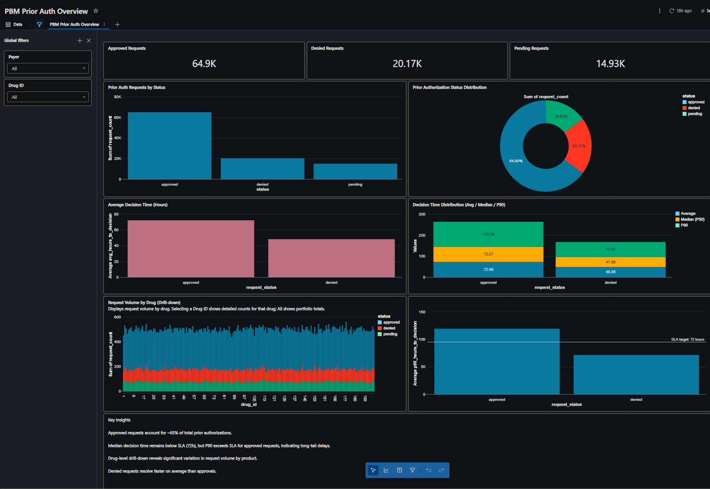

# 🏥 PBM Prior Authorization Analytics Engineering Pipeline

End-to-end analytics engineering project modeling prior authorization workflows in a Pharmacy Benefit Management (PBM) context.

## 🔧 Tech Stack
- Databricks (Lakehouse + Dashboards)
- dbt (staging → marts)
- Delta / Iceberg tables
- SQL
- Git / GitHub

## 📊 Key Use Cases
- Prior authorization approval / denial rates
- Decision time SLA monitoring (Avg / Median / P90)
- Drug-level request volume analysis
- Operational bottleneck identification

## 🧬 dbt Models & Lineage
Detailed dbt models, tests, and lineage graphs live here:

👉 **[dbt project documentation](pbm_prior_auth_dbt/README.md)**

## 📊 Databricks Dashboard
Below are screenshots and a walkthrough of the Databricks dashboard
(built in Databricks; screenshots provided for public viewing):

> Note: Databricks dashboards require workspace authentication; screenshots are provided for recruiter access.

### Dashboard Highlights
- Prior authorization approval vs denial rates by drug and plan
- Decision time SLA metrics (Avg / Median / P90)
- Daily request volume trends to identify operational bottlenecks

🔗 Databricks dashboard (workspace login required): [Open dashboard](https://dbc-ead16b1d-725e.cloud.databricks.com/dashboardsv3/01f106161bc91d72ab8588f835044891/published?o=7474655666586788&f_e8e705f4%7Epayer-id=_all)

##   Highlights
- Bronze → staging → analytics-ready marts
- Fact / dimension modeling
- SLA-focused metrics
- Production-style lineage via `dbt docs`

