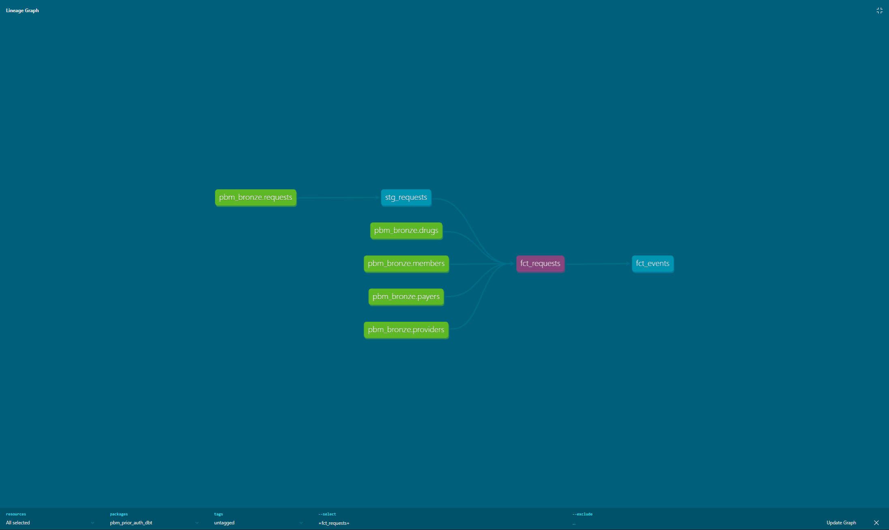
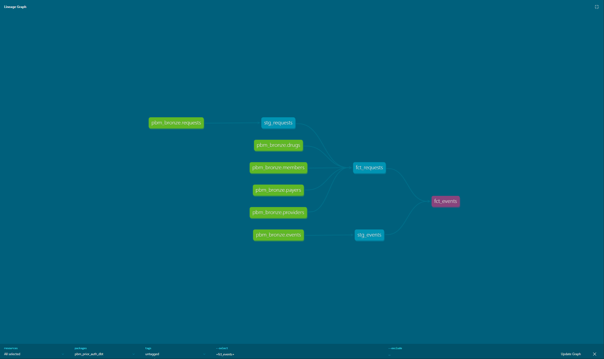

# dbt Project (PBM Prior Auth)

This folder contains the dbt project used to build the analytics-ready models for the PBM Prior Authorization pipeline.

👉 **Main project overview (start here):**  
../../README.md

---

## Lineage Graphs

### fct_requests


### fct_events


---

## How to View Lineage Locally

```bash
dbt docs generate
dbt docs serve --port 8089


